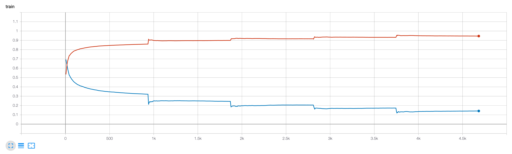
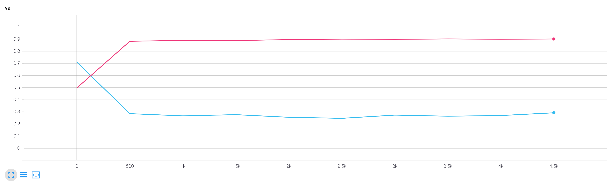

# 108.413A: Studies in Computational Linguistics 1 (2019)

## Description

이 repository에는 신효필 교수님의 [서울대학교 언어학과 2019년 2학기 컴퓨터언어학연구1](https://hpshin.github.io/StudiesInComputationalLinguistics1/) 과목과 관련된 자료들을 정리하였습니다.

## [Final Project - KorBERT_NSMC](./KorBERT_NSMC)

### Data

The [Naver sentiment movie corpus](https://github.com/e9t/nsmc) (a.k.a. NSMC)

### Model 

Based on [KorBERT_WordPiece](http://aiopen.etri.re.kr/service_dataset.php) from ETRI
* 학습데이터: 23GB 원시 말뭉치
* 딥러닝 라이브러리: pytorch, tensorflow
* 소스코드: tokenizer
* Latin alphabets: Cased

### [Results](./KorBERT_NSMC/model/summary_etri.json)

* Training Accuracy: 0.916
* Validation Accuracy (best): 0.900 
* Test: 0.899




### References

* **aisolab**: https://github.com/aisolab/nlp_implementation
* KoBERT(SKT): https://github.com/SKTBrain/KoBERT
* pytorch-sentiment-analysis: https://github.com/bentrevett/pytorch-sentiment-analysis
 

## Requirements

* See [requirements.yml](./requirements.yml)
* You can setup the env with conda:
```bash
conda env create -f requirements.yml --name compling && conda clean --all --yes
```