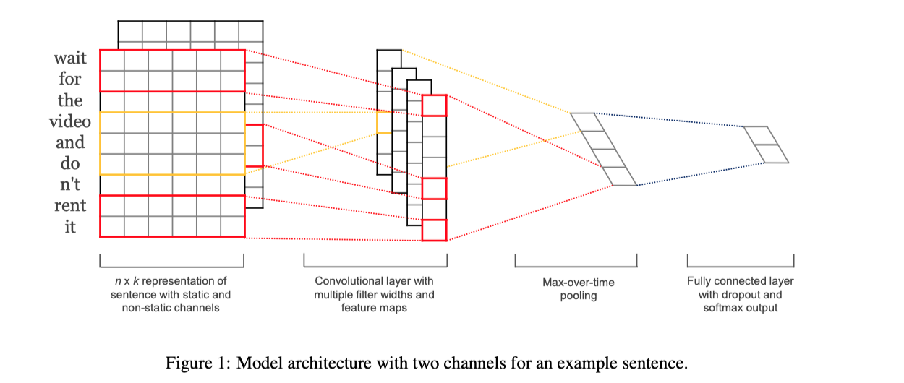
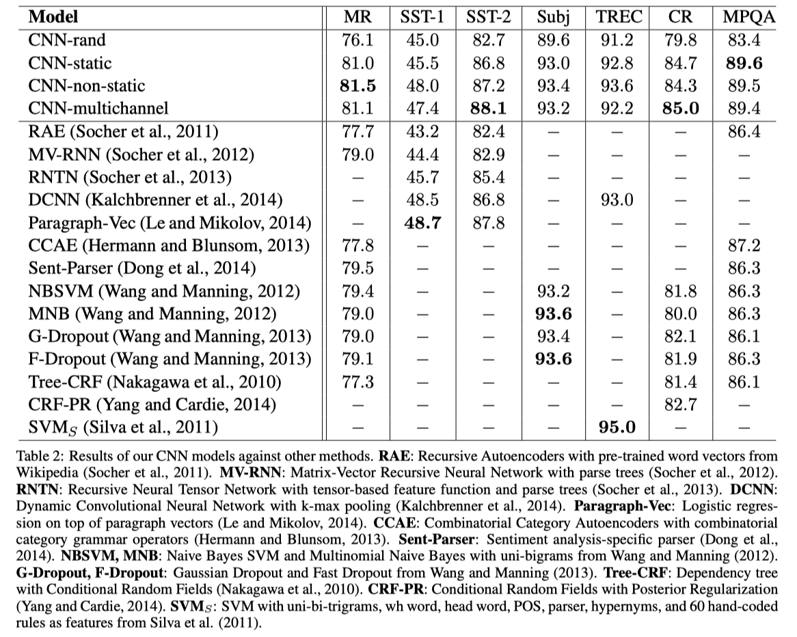
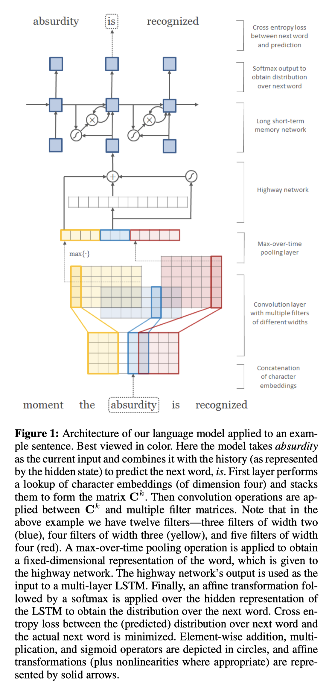
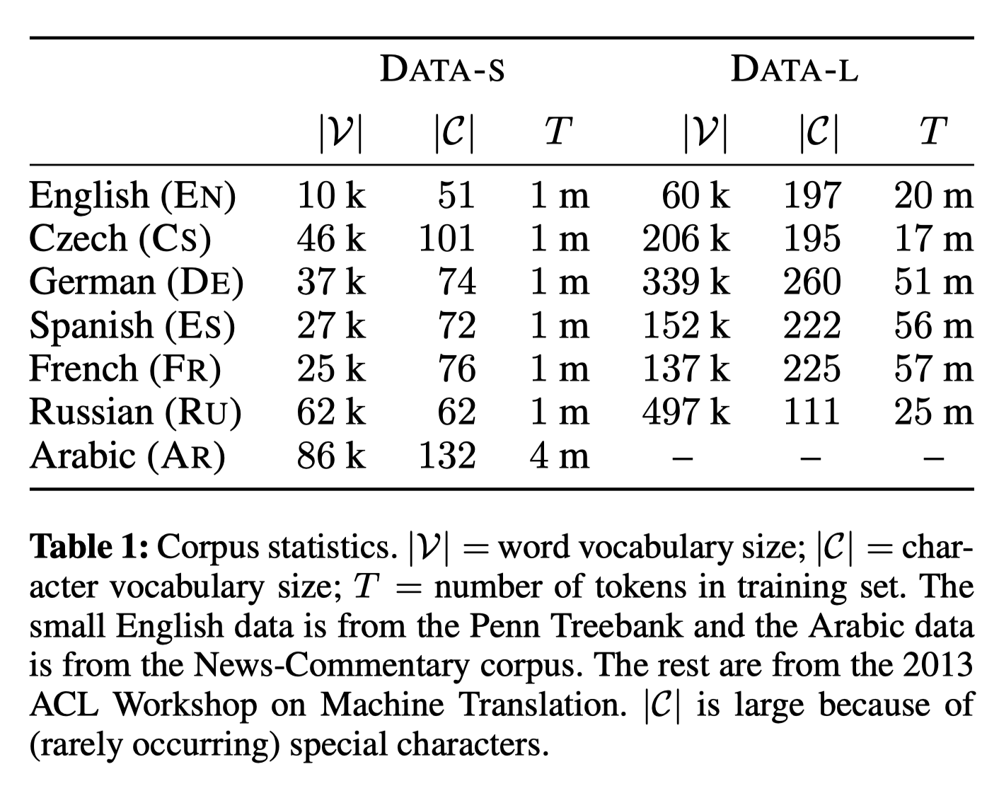
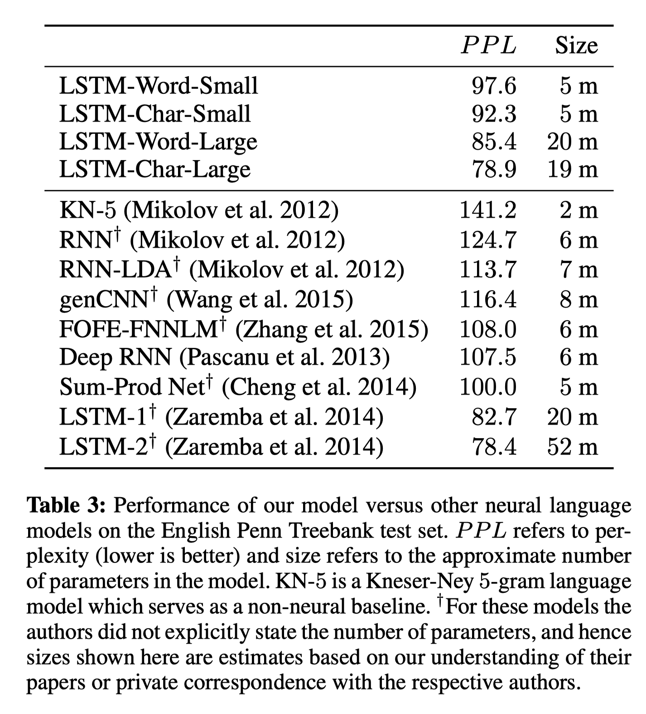

# 과제2: 페이퍼 요약

이경원

> 강의페이지에 있는 CNN 관련 두 페이퍼 
> 
> 1. Convolutional Neural Networks for Sentence Classification
> 2. Character-Aware Neural Language Models
> 
> 를 읽고 핵심적인 내용을 정리 요약해서 제출. 

$\newcommand{\real}{\mathbb{R}}$
$\newcommand{\bx}{\mathbf{x}}$
$\newcommand{\by}{\mathbf{y}}$
$\newcommand{\bz}{\mathbf{z}}$

## Convolutional Neural Networks for Sentence Classification[^kim2014model]

### Model

$\bx_i \in \real^k$를 $i$번째 단어(word)를 $k$차원 벡터(vector)로 표현한 것이라 하자. 그러면, $n$개의 단어로 이루어진 문장은 rowbind 연산자 $\oplus$를 통해 다음과 같이 나타낼 수 있다 $$\bx_{1:n} = \bx_1 \oplus \cdots \oplus \bx_n.$$
이때, 단어의 목록은 구글 뉴스의 단어를 이용한 Mikolov et al. (2013)[^mikolov2013]의 것을 사용하였다.

본 논문에서는 $\bx_{1:n}$을 input으로 갖는 1개의 CNN layer를 갖는 CNN 모형들을 제안하였으며, 이를 바탕으로 다양한 작업들을 수행하였다.
논문에서 제안된 모형의 형태는 채널의 수를 제외하면 모두 같으며, Figure 1은 뒤에서 소개할 `CNN-multichannel` 모형을 도식화한 것이다.

모형은 매우 간단한 형태를 가지고 있는데, 각 채널(channel; static and non-static channel)에 대해 convolution과 Max-over-time pooling을 적용하고, fully connected layer로 적절한 작업을 수행한다. 이때, convolution layer의 filter는 $h_i \times k$의 형태로 구성되어있으며 본 논문에서는 $h_i$ 값으로 3, 4, 5를 사용하였다. 각 $h_i$는 convolution이 적용될 단어의 수로 이해할 수 있다. feature map의 크기는 100으로, fully connected layer에는 $p=0.5$인 dropout을 적용하였으며 가중치(weight)들의 $l_2$-norm이 3을 넘지 않도록 제한을 두었다. 학습은 mini-batch size of 50의 SGD와 Adadelta를 사용하였다.

논문에서는 단어를 벡터에 대응시키는 변환(word embedding)을 학습시키는 경우(rand, non-static)와 그렇지 않은 경우(static)의 모형과 기존에 잘 알려진 변환 `word2vec`을 이용하는 경우(static, non-static)과 그렇지 않은 경우(rand)의 모형을 모두 고려하였으며, 이들을 결합한 모형(multichannel) 또한 제안하였다. 논문에 제안된 모형들의 구체적인 사항은 다음과 같다.

* `CNN-rand`: baseline model where all words are randomly initialized and then modified during training.
* `CNN-static`: A model with pre-trained vectors from `word2vec`. All wordsincluding the unknown ones that are randomly initialized are kept static and only the other parameters of the model are learned.
* `CNN-non-static`: Same as above but the pretrained vectors are fine-tuned for each task.
* `CNN-multichannel`: A model with two sets of word vectors. Each set of vectors is treated as a ‘channel’ and each filter is applied to both channels, but gradients are backpropagated only through one of the channels. Hence the model is able to fine-tune one set of vectors while keeping the other static. Both channels are initialized with `word2vec`.

Fully connected layer의 형태는 모형이 사용될 자료에 따라 다르게 주어진다. 논문에서는 `MR`(Movie Revies), `SST-1`(Stanford Sentiment Treebank)와 같은 다양한 자료에 모형들을 학습시켰으며, 그 성능을  기존의 모형들과 비교하였다.

### Results and Discussion

성능을 비교한 결과가 Table 2에 정리되어있다. 

절반 이상의 자료에서 제안된 모형들이 기존의 모형들보다 더 나은 성능을 보여주었다. 제안된 모형 중에서는 `CNN-rand`이 가장 성능이 떨어졌으며, 이는 word embedding 사전학습(pre-training)의 중요성을 보여준다. 저자는 `CNN-non-static`이 학습 중 단어를 자료(task)에 더 특화된 형태로 변환시키고 있음을 확인하였으며, `CNN-multichannel`이 기대했던 것(과적합 해소 등) 만큼의 성능 향상을 꾀하지는 못하였다는 점 또한 언급하고 있다.

### Conclusion

본 논문에서는 `word2vec`와 같은 잘 학습된 word embedding과 매우 간단한 형태의 CNN 모형 만으로도 일정 수준 이상의 자연어 처리가 가능하다는 것을 보여주고 있다. 또한, 이 논문에서는 여러 모형의 성능 비교를 통해 딥러닝을 이용한 자연어 처리 분야에서 잘 구축된 word embedding 연구의 필요성을 보여준다.

## Convolutional Neural Networks for Sentence Classification[^kim2015character]

* RNN input으로 들어가는 word embedding vector를 character-level CNN으로 만들어냄

### Model

길이 $T$ 문장 $w_{1:T} = [w_1, \cdots, w_T]$을 생각하자. 본 논문에서 제안된 모형은 시점 $t$ 번째 단어(word) $w_t$를 입력받아 $t+1$ 번째 단어 $w_{t+1}$을 출력한다. 모형의 구체적인 형태는 다음과 같다.

먼저, character-level CNN 모형`CharCNN`)은 Kim, Y. (2014)의 convolution layer와 max-over-time pooling을 통해 적당한 word embedding $\by ^k$를 계산한다. 이는 단어에 여러 $n$-gram을 적용해 특징(freature)를 추출한 것으로 이해할 수 있다. 이때, 입력된 단어의 길이가 다른 문제는 Max-over-time pooling layer를 거치는 것으로 해결된다. 기존의 모형들과의 비교를 위해, 이 층을 사용하지 않고 word embedding으로부터 계산된 값 $\bx^k$를 사용하는 모형도 적합하였다.

다음으로, LSTM(RNN) 모형으로 embedded word로부터 다음 글자 $w_{t+1}$을 예측한다. 이때, RNN의 입력으로는 바로 $\by^k$를 사용하지 않고, 다음과 같이 정의되는 highway network를 통해 변환된 $\bz^k$를 사용한다

$$\bz = t \odot g(W_H \by + b_H) + (1-t) \odot \by.$$

여기서 $g$ 는 적당한 비선형 함수이며, $t = \sigma(W_T y + b_T)$이다. Figure 1은 지금까지 소개한 모형을 도식화한 것이다.

모형의 학습은 다음과 같이 정의되는 negative log-likelihood($NLL$)을 최소화하는 방향으로 진행된다

$$NLL = -\sum_{t=1}^T \log Pr(w_t | w_{1:{t-1}}).$$

여기서 $Pr(\cdot | \cdot)$은 hierarchical softmax function을 사용하였으며, 과적합을 피하기 위해 dropout과 같은 regularization이 적용되었다.

모형 성능의 비교를 위해 English Penn Treebank (PTB) 자료와 Table 1의 다양한 언어로 구성된 자료를 사용하여 모형을 학습하였다. 

### Results and Discussion

PTB 자료에 대해 기존의 모형들과 논문의 모형을 비교한 결과는 다음과 같다. 저자는 논문에 도입한 `CharCNN`층의 효과를 확인하기 위해, 이 층을 도입하지 않은 모형인 `LSTM-Word-*`모형의 성능도 함께 제안하였다.

여기서 size는 모형을 구성하는 parameter의 수, 모형의 성능으로 사용되는 perplexity(PPL)는 다음과 같이 정의되며, 낮은 값일수록 더 나은 성능을 의미한다

$$PPL = \exp(NLL/T) .$$

논문에서 제안된 모형이 가장 좋은 성능을 갖는 것으로 확인되었으며, 다른 자료들에 대해서도 비슷한 결과를 보여주었다. 저자들은 `CharCNN`이 word embedding과 비슷하게 단어의 유사도를 학습하고 있다는 점을 확인하였으며, highway layer를 도입하는 것이, 그렇지 않은 것에 비해 더 나은 성능을 주고 있다는 점을 함께 언급하였다.

### Conclusion

본 논문에서는 별도의 word embedding을 사용하지 않고 자연어 입력만으로 우수한 성능을 갖는 모형의 학습이 가능하다는 것을 보여준다. 이는 자연어 처리에서도 종단 간 학습(end-to-end learning)이 가능하다는 것으로 이해할 수 있다.

[^kim2014model]: Kim, Y. (2014). Convolutional neural networks for sentence classification. arXiv preprint arXiv:1408.5882.
[^kim2015character]: Kim, Y., Jernite, Y., Sontag, D., & Rush, A. M. (2016, March). Character-aware neural language models. In Thirtieth AAAI Conference on Artificial Intelligence.
[^mikolov2013]: Mikolov, T., Sutskever, I., Chen, K., Corrado, G. S., & Dean, J. (2013). Distributed representations of words and phrases and their compositionality. In Advances in neural information processing systems (pp. 3111-3119).

